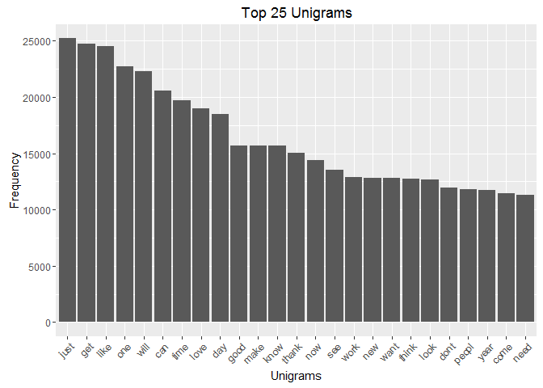
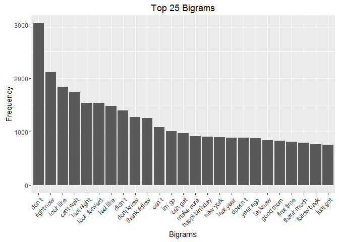
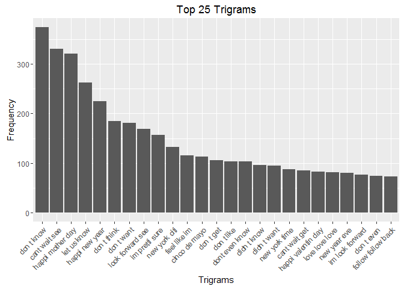

# Milestone Report for Johns Hopkins Coursera Data Science Capstone
JBrand  
March 14, 2016  

## Introduction
Around the world, people are spending an increasing amount of time on their mobile devices for email, social networking, banking and a whole range of other activities. But typing on mobile devices can be a serious pain. SwiftKey, our corporate partner in this capstone, builds a smart keyboard that makes it easier for people to type on their mobile devices. One cornerstone of their smart keyboard is predictive text models.  The purpose of this report is to document the beginning of the project, from data import to initial exploratory analysis.

## Data Acquisition, Import, and Sampling

### Acquisition
The first step in the process is to download the file from the weblink:   [https://d396qusza40orc.cloudfront.net/dsscapstone/dataset/Coursera-SwiftKey.zip](https://d396qusza40orc.cloudfront.net/dsscapstone/dataset/Coursera-SwiftKey.zip)

```r
sourcefile <- "https://d396qusza40orc.cloudfront.net/dsscapstone/dataset/Coursera-SwiftKey.zip"
download.file(sourcefile,"Data/Original/Coursera-SwiftKey.zip")
unzip("Data/Original/Coursera-SwiftKey.zip")
```

### Import
Now that we have the data downloaded and unzipped, we need to import the data into R so we can sample it. In this case, because the files are so large we don't want to do the analysis on the complete dataset because it will require a lot of computing power and time.


```r
## First we create connections to the files so we can read them
conTwitter <- file("Data/Original/en_US/en_US.twitter.txt", "r")
conNews <- file("Data/Original/en_US/en_US.news.txt", "r")
conBlogs <- file("Data/Original/en_US/en_US.blogs.txt", "r")

## Now we'll read in the data from those connections
tweets <- readLines(conTwitter, encoding = "UTF-8")
news <- readLines(conNews, encoding = "UTF-8")
blogs <- readLines(conBlogs, encoding = "UTF-8")

## And for tidiness, we'll now close and remove the connections as they're no longer needed
close(conTwitter)
close(conNews)
close(conBlogs)
rm(conTwitter, conNews, conBlogs)

## One final step, to remove all the really weird characters, we'll convert back 
## to ascii and replace strange junk with a space which will get removed later
tweets <- iconv(tweets, "UTF-8", "ascii", sub = " ")
news <- iconv(news, "UTF-8", "ascii", sub = " ")
blogs <- iconv(blogs, "UTF-8", "ascii", sub = " ")
```

### Sampling
It's sample time.  I'm just going to use a random 10% percent of each of the files. And even though I'm setting a seed so it will always sample the same, I'm going to write the samples to sample files so they're always separate and easy to handle.

```r
## Now we sample - I'll use 10% of the lines from each file - which is still conservative.
set.seed(7263)
sampT <- tweets[sample(1:length(tweets),(length(tweets)*.1))]
sampN <- news[sample(1:length(news),(length(news)*.1))]
sampB <- blogs[sample(1:length(blogs),(length(blogs)*.1))]

## Now we'll write to files
writeLines(sampT,"Data/Sampled/sampleTweets.txt")
writeLines(sampN,"Data/Sampled/sampleNews.txt")
writeLines(sampB,"Data/Sampled/sampleBlogs.txt")

## Now that we have everything written to files, we can clear out the memory and make some space.
rm(tweets, news, blogs, sampT, sampN, sampB)
```

## Corpus Creation and Cleaning

```r
library(tm)
library(SnowballC)
```
We're going to use the `tm` package for this exercise. So the first thing we need to do is take our new, sampled text files and define a corpus that contains them

```r
myCorpus <- Corpus(DirSource("Data/Sampled"), readerControl=list(reader=readPlain,language="en"))
```
Now that we have a nice clean corpus full of sampled data, we need to clean it up.  It's full of all sorts of things that make natural language processing difficult, i.e.

* capital letters  
* common punctuation  
* numbers  
* English stop words  
* special characters like @ / |  
* whitespace 

Then we'll also want to look at stemming, or the process of reducing inflected words to their stem, or root. An example would be taking "fishing", "fished", and "fisher" and using the root word "fish".


```r
myCorpus <- tm_map(myCorpus, content_transformer(tolower)) ## all lowercase
myCorpus <- tm_map(myCorpus, removePunctuation) ## dump punctuation
myCorpus <- tm_map(myCorpus, removeNumbers) ## dump numbers
myCorpus <- tm_map(myCorpus, removeWords, stopwords("english")) ## dump stopwords

createspace <- content_transformer(function(x, pattern) gsub(pattern, " ", x))
myCorpus <- tm_map(myCorpus, createspace, "/|@|\\|") ## function to remove funky characters
rm(createspace)

myCorpus <- tm_map(myCorpus, stripWhitespace) ## remove whitespace
myCorpus <- tm_map(myCorpus, stemDocument, language="english") ## do the stemming
```

## Tokenization
So now that we have a good clean corpus, we can start the tokenization process.  In this case, we want to determine the tokens (words) and also look at some of the N-grams, or ordered sets of words.  We'll look at single words, two-word phrases, and three-word phrases.


```r
library(RWeka)

## these commands create the tokenizing functions for each level of N-gram
unigramTokenizer <- function(x) NGramTokenizer(x, Weka_control(min=1, max=1))
bigramTokenizer <- function(x) NGramTokenizer(x, Weka_control(min=2, max=2))
trigramTokenizer <- function(x) NGramTokenizer(x, Weka_control(min=3, max=3))

## these commands actually create the document term matrix for each N-gram
unigramDTM <- DocumentTermMatrix(myCorpus, control = list(tokenize=unigramTokenizer))
bigramDTM <- DocumentTermMatrix(myCorpus, control = list(tokenize=bigramTokenizer))
trigramDTM <- DocumentTermMatrix(myCorpus, control = list(tokenize=trigramTokenizer))
```

## Looking at N-gram Frequencies
So now that we've tokenized for N-grams of length 1, 2, and 3, we can look at the results. First thing we need to do is take our new Document Term Matrices and sort them and pull out the top 25 from each.


```r
uniFreqMatrix <- sort(colSums(as.matrix(unigramDTM)), decreasing=TRUE)
uniFreq <- data.frame(word=names(uniFreqMatrix), freq=uniFreqMatrix, stringsAsFactors = FALSE)
rownames(uniFreq) <- NULL
uniTop25 <- uniFreq[1:25,]
rm(uniFreqMatrix)

biFreqMatrix <- sort(colSums(as.matrix(bigramDTM)), decreasing=TRUE)
biFreq <- data.frame(word=names(biFreqMatrix), freq=biFreqMatrix, stringsAsFactors = FALSE)
rownames(biFreq) <- NULL
biTop25 <- biFreq[1:25,]
rm(biFreqMatrix)

triFreqMatrix <- sort(colSums(as.matrix(trigramDTM)), decreasing=TRUE)
triFreq <- data.frame(word=names(triFreqMatrix), freq=triFreqMatrix, stringsAsFactors = FALSE)
rownames(triFreq) <- NULL
triTop25 <- triFreq[1:25,]
rm(triFreqMatrix)
```

```r
library(knitr)
t1 = kable(uniTop25, format = "html", output = F, align = c("l", "c", "c", "c"), escape=F, table.attr="class='table table-striped table-hover'")
t2 = kable(biTop25, format = "html", output = F, align = c("l", "c", "c", "c"), escape=F, table.attr="class='table table-striped table-hover'")
t3 = kable(triTop25, format = "html", output = F, align = c("l", "c", "c", "c"), escape=F, table.attr="class='table table-striped table-hover'")
cat(c('<table><tr><td>"UniGrams"</td><td>', t1, '</td><td>"BiGrams"</td><td>', t2, '</td><td>"TriGrams"</td><td>', t3, '</td><tr></table>'), sep = '')
```

<table><tr><td>"UniGrams"</td><td><table class='table table-striped table-hover'>
 <thead>
  <tr>
   <th style="text-align:left;"> word </th>
   <th style="text-align:center;"> freq </th>
  </tr>
 </thead>
<tbody>
  <tr>
   <td style="text-align:left;"> just </td>
   <td style="text-align:center;"> 25229 </td>
  </tr>
  <tr>
   <td style="text-align:left;"> get </td>
   <td style="text-align:center;"> 24722 </td>
  </tr>
  <tr>
   <td style="text-align:left;"> like </td>
   <td style="text-align:center;"> 24544 </td>
  </tr>
  <tr>
   <td style="text-align:left;"> one </td>
   <td style="text-align:center;"> 22690 </td>
  </tr>
  <tr>
   <td style="text-align:left;"> will </td>
   <td style="text-align:center;"> 22281 </td>
  </tr>
  <tr>
   <td style="text-align:left;"> can </td>
   <td style="text-align:center;"> 20598 </td>
  </tr>
  <tr>
   <td style="text-align:left;"> time </td>
   <td style="text-align:center;"> 19674 </td>
  </tr>
  <tr>
   <td style="text-align:left;"> love </td>
   <td style="text-align:center;"> 19010 </td>
  </tr>
  <tr>
   <td style="text-align:left;"> day </td>
   <td style="text-align:center;"> 18466 </td>
  </tr>
  <tr>
   <td style="text-align:left;"> good </td>
   <td style="text-align:center;"> 15672 </td>
  </tr>
  <tr>
   <td style="text-align:left;"> make </td>
   <td style="text-align:center;"> 15660 </td>
  </tr>
  <tr>
   <td style="text-align:left;"> know </td>
   <td style="text-align:center;"> 15649 </td>
  </tr>
  <tr>
   <td style="text-align:left;"> thank </td>
   <td style="text-align:center;"> 15033 </td>
  </tr>
  <tr>
   <td style="text-align:left;"> now </td>
   <td style="text-align:center;"> 14423 </td>
  </tr>
  <tr>
   <td style="text-align:left;"> see </td>
   <td style="text-align:center;"> 13532 </td>
  </tr>
  <tr>
   <td style="text-align:left;"> work </td>
   <td style="text-align:center;"> 12897 </td>
  </tr>
  <tr>
   <td style="text-align:left;"> new </td>
   <td style="text-align:center;"> 12844 </td>
  </tr>
  <tr>
   <td style="text-align:left;"> want </td>
   <td style="text-align:center;"> 12790 </td>
  </tr>
  <tr>
   <td style="text-align:left;"> think </td>
   <td style="text-align:center;"> 12735 </td>
  </tr>
  <tr>
   <td style="text-align:left;"> look </td>
   <td style="text-align:center;"> 12689 </td>
  </tr>
  <tr>
   <td style="text-align:left;"> dont </td>
   <td style="text-align:center;"> 11912 </td>
  </tr>
  <tr>
   <td style="text-align:left;"> peopl </td>
   <td style="text-align:center;"> 11802 </td>
  </tr>
  <tr>
   <td style="text-align:left;"> year </td>
   <td style="text-align:center;"> 11744 </td>
  </tr>
  <tr>
   <td style="text-align:left;"> come </td>
   <td style="text-align:center;"> 11461 </td>
  </tr>
  <tr>
   <td style="text-align:left;"> need </td>
   <td style="text-align:center;"> 11309 </td>
  </tr>
</tbody>
</table></td><td>"BiGrams"</td><td><table class='table table-striped table-hover'>
 <thead>
  <tr>
   <th style="text-align:left;"> word </th>
   <th style="text-align:center;"> freq </th>
  </tr>
 </thead>
<tbody>
  <tr>
   <td style="text-align:left;"> don t </td>
   <td style="text-align:center;"> 3028 </td>
  </tr>
  <tr>
   <td style="text-align:left;"> right now </td>
   <td style="text-align:center;"> 2111 </td>
  </tr>
  <tr>
   <td style="text-align:left;"> look like </td>
   <td style="text-align:center;"> 1834 </td>
  </tr>
  <tr>
   <td style="text-align:left;"> cant wait </td>
   <td style="text-align:center;"> 1738 </td>
  </tr>
  <tr>
   <td style="text-align:left;"> last night </td>
   <td style="text-align:center;"> 1541 </td>
  </tr>
  <tr>
   <td style="text-align:left;"> look forward </td>
   <td style="text-align:center;"> 1539 </td>
  </tr>
  <tr>
   <td style="text-align:left;"> feel like </td>
   <td style="text-align:center;"> 1481 </td>
  </tr>
  <tr>
   <td style="text-align:left;"> didn t </td>
   <td style="text-align:center;"> 1400 </td>
  </tr>
  <tr>
   <td style="text-align:left;"> dont know </td>
   <td style="text-align:center;"> 1278 </td>
  </tr>
  <tr>
   <td style="text-align:left;"> thank follow </td>
   <td style="text-align:center;"> 1250 </td>
  </tr>
  <tr>
   <td style="text-align:left;"> can t </td>
   <td style="text-align:center;"> 1084 </td>
  </tr>
  <tr>
   <td style="text-align:left;"> im go </td>
   <td style="text-align:center;"> 1010 </td>
  </tr>
  <tr>
   <td style="text-align:left;"> can get </td>
   <td style="text-align:center;"> 973 </td>
  </tr>
  <tr>
   <td style="text-align:left;"> make sure </td>
   <td style="text-align:center;"> 913 </td>
  </tr>
  <tr>
   <td style="text-align:left;"> happi birthday </td>
   <td style="text-align:center;"> 902 </td>
  </tr>
  <tr>
   <td style="text-align:left;"> new york </td>
   <td style="text-align:center;"> 896 </td>
  </tr>
  <tr>
   <td style="text-align:left;"> last year </td>
   <td style="text-align:center;"> 887 </td>
  </tr>
  <tr>
   <td style="text-align:left;"> doesn t </td>
   <td style="text-align:center;"> 885 </td>
  </tr>
  <tr>
   <td style="text-align:left;"> year ago </td>
   <td style="text-align:center;"> 880 </td>
  </tr>
  <tr>
   <td style="text-align:left;"> let know </td>
   <td style="text-align:center;"> 838 </td>
  </tr>
  <tr>
   <td style="text-align:left;"> good morn </td>
   <td style="text-align:center;"> 834 </td>
  </tr>
  <tr>
   <td style="text-align:left;"> first time </td>
   <td style="text-align:center;"> 810 </td>
  </tr>
  <tr>
   <td style="text-align:left;"> thank much </td>
   <td style="text-align:center;"> 796 </td>
  </tr>
  <tr>
   <td style="text-align:left;"> follow back </td>
   <td style="text-align:center;"> 769 </td>
  </tr>
  <tr>
   <td style="text-align:left;"> just got </td>
   <td style="text-align:center;"> 760 </td>
  </tr>
</tbody>
</table></td><td>"TriGrams"</td><td><table class='table table-striped table-hover'>
 <thead>
  <tr>
   <th style="text-align:left;"> word </th>
   <th style="text-align:center;"> freq </th>
  </tr>
 </thead>
<tbody>
  <tr>
   <td style="text-align:left;"> don t know </td>
   <td style="text-align:center;"> 374 </td>
  </tr>
  <tr>
   <td style="text-align:left;"> cant wait see </td>
   <td style="text-align:center;"> 330 </td>
  </tr>
  <tr>
   <td style="text-align:left;"> happi mother day </td>
   <td style="text-align:center;"> 321 </td>
  </tr>
  <tr>
   <td style="text-align:left;"> let us know </td>
   <td style="text-align:center;"> 262 </td>
  </tr>
  <tr>
   <td style="text-align:left;"> happi new year </td>
   <td style="text-align:center;"> 225 </td>
  </tr>
  <tr>
   <td style="text-align:left;"> don t think </td>
   <td style="text-align:center;"> 184 </td>
  </tr>
  <tr>
   <td style="text-align:left;"> don t want </td>
   <td style="text-align:center;"> 181 </td>
  </tr>
  <tr>
   <td style="text-align:left;"> look forward see </td>
   <td style="text-align:center;"> 169 </td>
  </tr>
  <tr>
   <td style="text-align:left;"> im pretti sure </td>
   <td style="text-align:center;"> 157 </td>
  </tr>
  <tr>
   <td style="text-align:left;"> new york citi </td>
   <td style="text-align:center;"> 133 </td>
  </tr>
  <tr>
   <td style="text-align:left;"> feel like im </td>
   <td style="text-align:center;"> 115 </td>
  </tr>
  <tr>
   <td style="text-align:left;"> cinco de mayo </td>
   <td style="text-align:center;"> 113 </td>
  </tr>
  <tr>
   <td style="text-align:left;"> don t get </td>
   <td style="text-align:center;"> 106 </td>
  </tr>
  <tr>
   <td style="text-align:left;"> don t like </td>
   <td style="text-align:center;"> 103 </td>
  </tr>
  <tr>
   <td style="text-align:left;"> dont even know </td>
   <td style="text-align:center;"> 103 </td>
  </tr>
  <tr>
   <td style="text-align:left;"> didn t know </td>
   <td style="text-align:center;"> 96 </td>
  </tr>
  <tr>
   <td style="text-align:left;"> didn t want </td>
   <td style="text-align:center;"> 95 </td>
  </tr>
  <tr>
   <td style="text-align:left;"> new york time </td>
   <td style="text-align:center;"> 88 </td>
  </tr>
  <tr>
   <td style="text-align:left;"> cant wait get </td>
   <td style="text-align:center;"> 85 </td>
  </tr>
  <tr>
   <td style="text-align:left;"> happi valentin day </td>
   <td style="text-align:center;"> 83 </td>
  </tr>
  <tr>
   <td style="text-align:left;"> love love love </td>
   <td style="text-align:center;"> 82 </td>
  </tr>
  <tr>
   <td style="text-align:left;"> new year eve </td>
   <td style="text-align:center;"> 80 </td>
  </tr>
  <tr>
   <td style="text-align:left;"> im look forward </td>
   <td style="text-align:center;"> 76 </td>
  </tr>
  <tr>
   <td style="text-align:left;"> don t even </td>
   <td style="text-align:center;"> 74 </td>
  </tr>
  <tr>
   <td style="text-align:left;"> follow follow back </td>
   <td style="text-align:center;"> 73 </td>
  </tr>
</tbody>
</table></td><tr></table>

```r
library(ggplot2)
ggplot(uniTop25, aes(x=reorder(word, -freq), y=freq)) + geom_bar(stat="identity") + ggtitle("Top 25 Unigrams") + xlab("Unigrams") + ylab("Frequency") + theme(axis.text.x=element_text(angle=45, hjust=1))
```



```r
ggplot(biTop25, aes(x=reorder(word, -freq), y=freq)) + geom_bar(stat="identity") + ggtitle("Top 25 Bigrams") + xlab("Bigrams") + ylab("Frequency") + theme(axis.text.x=element_text(angle=45, hjust=1))
```



```r
ggplot(triTop25, aes(x=reorder(word, -freq), y=freq)) + geom_bar(stat="identity") + ggtitle("Top 25 Trigrams") + xlab("Trigrams") + ylab("Frequency") + theme(axis.text.x=element_text(angle=45, hjust=1))
```



So there's definitely something a bit strange in the bigrams and trigrams since the removal of apostrophes causes the contractions like "don't" to appear as "don" "t" and were tokenized separately. Definitely something I'll need to go back and figure out.  I'm not sure why the stripWhitespace didn't work on those.  But either way, it's a very interesting list.  I'll also need to dig into treating mis-spellings as equivalents - as an example look in the bigrams at "happi birthday".

## Looking Forward
Now, an interesting question that was posed for this project was:  

"How many unique words do you need in a frequency sorted dictionary to cover 50% of all word instances in the language? 90%?"  

Interestingly, we can now use our 1-gram Frequency Data Frame to calculate that with a very simple loop:


```r
## To cover 50% of total word instances based on our sample:
i=0
x=0
while (x < sum(uniFreq[,2])*.5) {
    i <- i +1
    x <- x + uniFreq[i,2]
}
i
```

```
## [1] 504
```

```r
i=0
x=0
while (x < sum(uniFreq[,2])*.9) {
    i <- i +1
    x <- x + uniFreq[i,2]
}
i
```

```
## [1] 7223
```
To cover 90% of all words used in the sample we took, we only need __7223 words__.  That's really not a lot, and quite impressive.  This will be useful later on as we look at doing the same exercise with our 2- and 3-grams to see how large our codex needs to be for our predictive algorithm.
