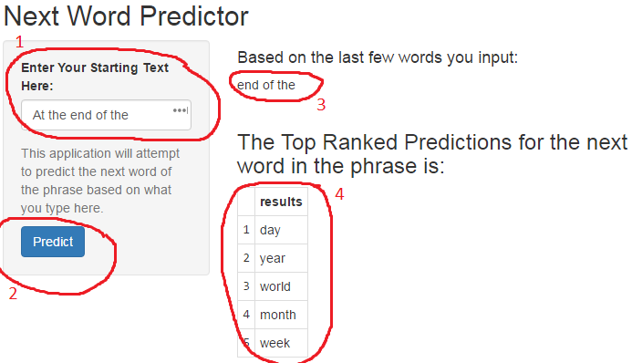

Next Word Predictor for Johns Hopkins Coursera Data Science Capstone Project
========================================================
author: JBrand
date: 3/27/2016

Introduction
========================================================

Around the world, people are spending an increasing amount of time on their mobile devices for email, social networking, banking and a whole range of other activities. But typing on mobile devices can be a serious pain. SwiftKey, our corporate partner in this capstone, builds a smart keyboard that makes it easier for people to type on their mobile devices. One cornerstone of their smart keyboard is predictive text models.  The purpose of this presentation is to show and explain the application I created for next word prediction while typing.

How It Works
========================================================

* A Corpus was created from several million tweets, blogs posts, and news articles that were provided as part of the project

* From there, data was cleaned and processed into 1,2,3, and 4-grams (i.e. 3-word or 4-word phrases).

* The frequency of each n-gram was calculated so a final model could be created to predict what the next word would be in an input phrase.

* An additional step called stupid backoff was also involved to help select the best option.

How to Use It
========================================================

***
1. Put in the first few words of your phrase.
2. Click the "Predict" button.
3. See how the interpreter cleans and takes the last few words of your input.
4. See the top ranked results for the predicted next word.

Conclusion
========================================================

I will be the first to admit that this is not the most accurate model. Based on my limited knowledge of Natural Language Processing, it was the best I could grasp.  But based on the stats, I'm happy with the results.

* Only 10% of the corpus was used for the training of the Term Document Matrices
* Of that, only 1/3 was kept.  I removed 2/3 of the sparse values.
* This allows for a very fast load time when you first open it, and almost immediate response when you use it.

Naturally, with using a larger amount of the corpus and keeping a greater number of the low frequency phrases there would be higher accuracy - but at the expense of size and speed.

