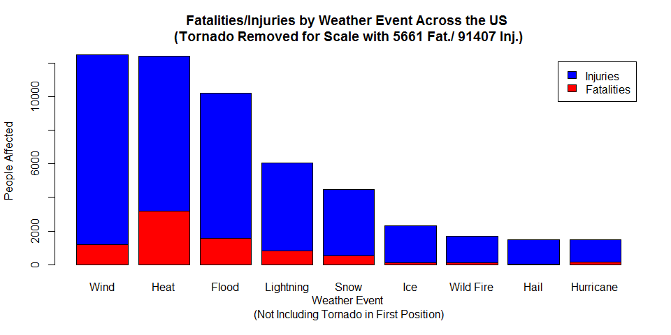
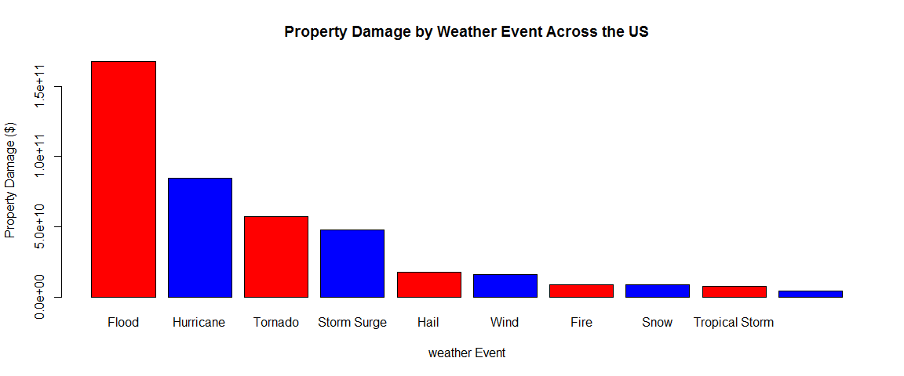

# Fatalities, Injuries, and Property Damage as a Result of Severe Weather

## Synopsis
The basic goal of this report is to explore the NOAA Storm Database and answer some basic questions about severe weather events. Our overall hypothesis is that in terms of fatalities, injuries, and property damage, not all weather events are created equally, and that some will have more severe impacts than others. The report is written to be read by a government or municipal manager who might be responsible for preparing for severe weather events and will need to prioritize resources for different types of events. 

## Introduction
Storms and other severe weather events can cause both public health and economic problems for communities and municipalities. Many severe events can result in fatalities, injuries, and property damage, and preventing such outcomes to the extent possible is a key concern.

This project involves exploring the U.S. National Oceanic and Atmospheric Administration's (NOAA) storm database. This database tracks characteristics of major storms and weather events in the United States, including when and where they occur, as well as estimates of any fatalities, injuries, and property damage.

## Data
The data for this analysis come in the form of a comma-separated-value file compressed via the bzip2 algorithm to reduce its size. You can download the file from the course web site:

* [Storm Data](https://d396qusza40orc.cloudfront.net/repdata%2Fdata%2FStormData.csv.bz2) [47Mb]

There is also some documentation of the database available. Here you will find how some of the variables are constructed/defined.

* National Weather Service [Storm Data Documentation](https://d396qusza40orc.cloudfront.net/repdata%2Fpeer2_doc%2Fpd01016005curr.pdf)
* National Climatic Data Center Storm Events [FAQ](https://d396qusza40orc.cloudfront.net/repdata%2Fpeer2_doc%2FNCDC%20Storm%20Events-FAQ%20Page.pdf)

The events in the database start in the year 1950 and end in November 2011. In the earlier years of the database there are generally fewer events recorded, most likely due to a lack of good records. More recent years should be considered more complete.

## Data Processing

The first step is to read in the data and check out what variables are included.

```r
fulldata <- read.csv("repdata-data-StormData.csv.bz2")
names(fulldata)
```

```
##  [1] "STATE__"    "BGN_DATE"   "BGN_TIME"   "TIME_ZONE"  "COUNTY"    
##  [6] "COUNTYNAME" "STATE"      "EVTYPE"     "BGN_RANGE"  "BGN_AZI"   
## [11] "BGN_LOCATI" "END_DATE"   "END_TIME"   "COUNTY_END" "COUNTYENDN"
## [16] "END_RANGE"  "END_AZI"    "END_LOCATI" "LENGTH"     "WIDTH"     
## [21] "F"          "MAG"        "FATALITIES" "INJURIES"   "PROPDMG"   
## [26] "PROPDMGEXP" "CROPDMG"    "CROPDMGEXP" "WFO"        "STATEOFFIC"
## [31] "ZONENAMES"  "LATITUDE"   "LONGITUDE"  "LATITUDE_E" "LONGITUDE_"
## [36] "REMARKS"    "REFNUM"
```

For the basis of this report, we are mainly interested in tracking fatalities, injuries, and property damage
across different weather events, and so our new working dataframe takes a subset of those variables.

```r
subdata <- fulldata[,c("EVTYPE","FATALITIES","INJURIES","PROPDMG","PROPDMGEXP")]
```

### Effects on Health

The first hypothesis to focus on is across the United States, certain types of events will be more harmful with respect to population health than others. What are they?  I will first subset only the weather events that have at least 1 fatality or injury. 


```r
library(plyr)
healthframe <- subset(subdata, FATALITIES > 0 | INJURIES > 0, select = EVTYPE:INJURIES)
healthframe <- ddply(healthframe, "EVTYPE", numcolwise(sum))
```

Upon looking through this data, it is also determined that due to non-standardized labeling of the weather events, we will need to do some aggregation of fields by doing string searches.  This will not be 100% complete, since there are several hundred options, but it will gather all the large occurence events. Additionally, there will be an output of how all the events were consolidated. This is a lot of code, and there is some subjectivity to how you consolidate, but all operations are shown so you can always adjust to your tastes as well.


```r
## Get the indexed and named values for matching labels in the weather event variable
temp <- grep("[Cc][Oo][Ll][Dd]|[Ll][Oo][Ww]", healthframe$EVTYPE)
tempv <- grep("[Cc][Oo][Ll][Dd]|[Ll][Oo][Ww]", healthframe$EVTYPE, value = TRUE)
## Create a new entry at bottom with the consolidated weather event and sum of values
healthframe <- rbind(healthframe, data.frame(EVTYPE = "Cold", FATALITIES = sum(healthframe$FATALITIES[temp]), INJURIES = sum(healthframe$INJURIES[temp])))
## Remove the rows we found
healthframe <- healthframe[-temp,]
## Add all consolidated values to the storage matrix
consolidate <- matrix(c(tempv,rep("Cold", length(tempv))), ncol = 2)

## Rinse and Repeat, and repeat, and repeat...
temp <- grep("[Ss][Nn][Oo][Ww]|[Ww][Ii][Nn][Tt]|[Bb][Ll][Ii][Zz]|[Mm][Ii][Xx][Ee][Dd]", healthframe$EVTYPE)
tempv <- grep("[Ss][Nn][Oo][Ww]|[Ww][Ii][Nn][Tt]|[Bb][Ll][Ii][Zz]|[Mm][Ii][Xx][Ee][Dd]", healthframe$EVTYPE, value = TRUE)
healthframe <- rbind(healthframe, data.frame(EVTYPE = "Snow", FATALITIES = sum(healthframe$FATALITIES[temp]), INJURIES = sum(healthframe$INJURIES[temp])))
healthframe <- healthframe[-temp,]
consolidate <- rbind(consolidate, matrix(c(tempv,rep("Snow", length(tempv))), ncol = 2))

temp <- grep("[Tt][Oo][Rr][Nn]", healthframe$EVTYPE)
tempv <- grep("[Tt][Oo][Rr][Nn]", healthframe$EVTYPE, value = TRUE)
healthframe <- rbind(healthframe, data.frame(EVTYPE = "Tornado", FATALITIES = sum(healthframe$FATALITIES[temp]), INJURIES = sum(healthframe$INJURIES[temp])))
healthframe <- healthframe[-temp,]
consolidate <- rbind(consolidate, matrix(c(tempv,rep("Tornado", length(tempv))), ncol = 2))

temp <- grep("[Rr][Aa][Ii][Nn]", healthframe$EVTYPE)
tempv <- grep("[Rr][Aa][Ii][Nn]", healthframe$EVTYPE, value = TRUE)
healthframe <- rbind(healthframe, data.frame(EVTYPE = "Rain", FATALITIES = sum(healthframe$FATALITIES[temp]), INJURIES = sum(healthframe$INJURIES[temp])))
healthframe <- healthframe[-temp,]
consolidate <- rbind(consolidate, matrix(c(tempv,rep("Rain", length(tempv))), ncol = 2))

temp <- grep("[Hh][Aa][Ii][Ll]", healthframe$EVTYPE)
tempv <- grep("[Hh][Aa][Ii][Ll]", healthframe$EVTYPE, value = TRUE)
healthframe <- rbind(healthframe, data.frame(EVTYPE = "Hail", FATALITIES = sum(healthframe$FATALITIES[temp]), INJURIES = sum(healthframe$INJURIES[temp])))
healthframe <- healthframe[-temp,]
consolidate <- rbind(consolidate, matrix(c(tempv,rep("Hail", length(tempv))), ncol = 2))

temp <- grep("[Ww][Ii][Nn][Dd]", healthframe$EVTYPE)
tempv <- grep("[Ww][Ii][Nn][Dd]", healthframe$EVTYPE, value = TRUE)
healthframe <- rbind(healthframe, data.frame(EVTYPE = "Wind", FATALITIES = sum(healthframe$FATALITIES[temp]), INJURIES = sum(healthframe$INJURIES[temp])))
healthframe <- healthframe[-temp,]
consolidate <- rbind(consolidate, matrix(c(tempv,rep("Wind", length(tempv))), ncol = 2))

temp <- grep("[Hh][Ee][Aa][Tt]|[Ww][Aa][Rr][Mm]", healthframe$EVTYPE)
tempv <- grep("[Hh][Ee][Aa][Tt]|[Ww][Aa][Rr][Mm]", healthframe$EVTYPE, value = TRUE)
healthframe <- rbind(healthframe, data.frame(EVTYPE = "Heat", FATALITIES = sum(healthframe$FATALITIES[temp]), INJURIES = sum(healthframe$INJURIES[temp])))
healthframe <- healthframe[-temp,]
consolidate <- rbind(consolidate, matrix(c(tempv,rep("Heat", length(tempv))), ncol = 2))

temp <- grep("[Ff][Ll][Oo][Oo][Dd]|[Uu][Rr][Bb][Aa][Nn]", healthframe$EVTYPE)
tempv <- grep("[Ff][Ll][Oo][Oo][Dd]|[Uu][Rr][Bb][Aa][Nn]", healthframe$EVTYPE, value = TRUE)
healthframe <- rbind(healthframe, data.frame(EVTYPE = "Flood", FATALITIES = sum(healthframe$FATALITIES[temp]), INJURIES = sum(healthframe$INJURIES[temp])))
healthframe <- healthframe[-temp,]
consolidate <- rbind(consolidate, matrix(c(tempv,rep("Flood", length(tempv))), ncol = 2))

temp <- grep("[Hh][Uu][Rr][Rr]", healthframe$EVTYPE)
tempv <- grep("[Hh][Uu][Rr][Rr]", healthframe$EVTYPE, value = TRUE)
healthframe <- rbind(healthframe, data.frame(EVTYPE = "Hurricane", FATALITIES = sum(healthframe$FATALITIES[temp]), INJURIES = sum(healthframe$INJURIES[temp])))
healthframe <- healthframe[-temp,]
consolidate <- rbind(consolidate, matrix(c(tempv,rep("Hurricane", length(tempv))), ncol = 2))

temp <- grep("[Ii][Cc][Ee]|[Ii][Cc][Yy]|[Ff][Rr][Ee][Ee][Zz]|[Ff][Rr][Oo][Ss][Tt]", healthframe$EVTYPE)
tempv <- grep("[Ii][Cc][Ee]|[Ii][Cc][Yy]|[Ff][Rr][Ee][Ee][Zz]|[Ff][Rr][Oo][Ss][Tt]", healthframe$EVTYPE, value = TRUE)
healthframe <- rbind(healthframe, data.frame(EVTYPE = "Ice", FATALITIES = sum(healthframe$FATALITIES[temp]), INJURIES = sum(healthframe$INJURIES[temp])))
healthframe <- healthframe[-temp,]
consolidate <- rbind(consolidate, matrix(c(tempv,rep("Ice", length(tempv))), ncol = 2))

temp <- grep("[Hh][Ee][Aa][Vv][Yy]|[Hh][Ii][Gg][Hh]|[Rr][Oo][Uu][Gg][Hh]|[Hh][Aa][Zz]", healthframe$EVTYPE)
tempv <- grep("[Hh][Ee][Aa][Vv][Yy]|[Hh][Ii][Gg][Hh]|[Rr][Oo][Uu][Gg][Hh]|[Hh][Aa][Zz]", healthframe$EVTYPE, value = TRUE)
healthframe <- rbind(healthframe, data.frame(EVTYPE = "High Seas", FATALITIES = sum(healthframe$FATALITIES[temp]), INJURIES = sum(healthframe$INJURIES[temp])))
healthframe <- healthframe[-temp,]
consolidate <- rbind(consolidate, matrix(c(tempv,rep("High Seas", length(tempv))), ncol = 2))

temp <- grep("[Ll][Ii][Gg][Hh][Tt][Nn][Ii][Nn][Gg]", healthframe$EVTYPE)
tempv <- grep("[Ll][Ii][Gg][Hh][Tt][Nn][Ii][Nn][Gg]", healthframe$EVTYPE, value = TRUE)
healthframe <- rbind(healthframe, data.frame(EVTYPE = "Lightning", FATALITIES = sum(healthframe$FATALITIES[temp]), INJURIES = sum(healthframe$INJURIES[temp])))
healthframe <- healthframe[-temp,]
consolidate <- rbind(consolidate, matrix(c(tempv,rep("Lightning", length(tempv))), ncol = 2))

temp <- grep("[Ff][Ii][Rr][Ee]", healthframe$EVTYPE)
tempv <- grep("[Ff][Ii][Rr][Ee]", healthframe$EVTYPE, value = TRUE)
healthframe <- rbind(healthframe, data.frame(EVTYPE = "Wild Fire", FATALITIES = sum(healthframe$FATALITIES[temp]), INJURIES = sum(healthframe$INJURIES[temp])))
healthframe <- healthframe[-temp,]
consolidate <- rbind(consolidate, matrix(c(tempv,rep("Wild Fire", length(tempv))), ncol = 2))

temp <- grep("[Ff][Oo][Gg]", healthframe$EVTYPE)
tempv <- grep("[Ff][Oo][Gg]", healthframe$EVTYPE, value = TRUE)
healthframe <- rbind(healthframe, data.frame(EVTYPE = "Fog", FATALITIES = sum(healthframe$FATALITIES[temp]), INJURIES = sum(healthframe$INJURIES[temp])))
healthframe <- healthframe[-temp,]
consolidate <- rbind(consolidate, matrix(c(tempv,rep("Fog", length(tempv))), ncol = 2))

temp <- grep("[Dd][Uu][Ss][Tt]", healthframe$EVTYPE)
tempv <- grep("[Dd][Uu][Ss][Tt]", healthframe$EVTYPE, value = TRUE)
healthframe <- rbind(healthframe, data.frame(EVTYPE = "Dust Storm", FATALITIES = sum(healthframe$FATALITIES[temp]), INJURIES = sum(healthframe$INJURIES[temp])))
healthframe <- healthframe[-temp,]
consolidate <- rbind(consolidate, matrix(c(tempv,rep("Dust Storm", length(tempv))), ncol = 2))

temp <- grep("[Rr][Ii][Pp]", healthframe$EVTYPE)
tempv <- grep("[Rr][Ii][Pp]", healthframe$EVTYPE, value = TRUE)
healthframe <- rbind(healthframe, data.frame(EVTYPE = "Rip Current", FATALITIES = sum(healthframe$FATALITIES[temp]), INJURIES = sum(healthframe$INJURIES[temp])))
healthframe <- healthframe[-temp,]
consolidate <- rbind(consolidate, matrix(c(tempv,rep("Rip Current", length(tempv))), ncol = 2))

temp <- grep("[Ss][Uu][Rr][Gg][Ee]", healthframe$EVTYPE)
tempv <- grep("[Ss][Uu][Rr][Gg][Ee]", healthframe$EVTYPE, value = TRUE)
healthframe <- rbind(healthframe, data.frame(EVTYPE = "Storm surge", FATALITIES = sum(healthframe$FATALITIES[temp]), INJURIES = sum(healthframe$INJURIES[temp])))
healthframe <- healthframe[-temp,]
consolidate <- rbind(consolidate, matrix(c(tempv,rep("Storm surge", length(tempv))), ncol = 2))

consolidate
```

```
##        [,1]                             [,2]         
##   [1,] "blowing snow"                   "Cold"       
##   [2,] "BLOWING SNOW"                   "Cold"       
##   [3,] "Cold"                           "Cold"       
##   [4,] "COLD"                           "Cold"       
##   [5,] "COLD AND SNOW"                  "Cold"       
##   [6,] "Cold Temperature"               "Cold"       
##   [7,] "COLD WAVE"                      "Cold"       
##   [8,] "COLD WEATHER"                   "Cold"       
##   [9,] "COLD/WIND CHILL"                "Cold"       
##  [10,] "COLD/WINDS"                     "Cold"       
##  [11,] "Extended Cold"                  "Cold"       
##  [12,] "Extreme Cold"                   "Cold"       
##  [13,] "EXTREME COLD"                   "Cold"       
##  [14,] "EXTREME COLD/WIND CHILL"        "Cold"       
##  [15,] "FOG AND COLD TEMPERATURES"      "Cold"       
##  [16,] "HIGH WINDS/COLD"                "Cold"       
##  [17,] "LOW TEMPERATURE"                "Cold"       
##  [18,] "RECORD COLD"                    "Cold"       
##  [19,] "SNOW/ BITTER COLD"              "Cold"       
##  [20,] "UNSEASONABLY COLD"              "Cold"       
##  [21,] "BLIZZARD"                       "Snow"       
##  [22,] "EXCESSIVE SNOW"                 "Snow"       
##  [23,] "FALLING SNOW/ICE"               "Snow"       
##  [24,] "FREEZING RAIN/SNOW"             "Snow"       
##  [25,] "HEAVY SNOW"                     "Snow"       
##  [26,] "HEAVY SNOW AND HIGH WINDS"      "Snow"       
##  [27,] "Heavy snow shower"              "Snow"       
##  [28,] "HEAVY SNOW/BLIZZARD/AVALANCHE"  "Snow"       
##  [29,] "HEAVY SNOW/ICE"                 "Snow"       
##  [30,] "HIGH WIND/HEAVY SNOW"           "Snow"       
##  [31,] "HIGH WINDS/SNOW"                "Snow"       
##  [32,] "LIGHT SNOW"                     "Snow"       
##  [33,] "MIXED PRECIP"                   "Snow"       
##  [34,] "RAIN/SNOW"                      "Snow"       
##  [35,] "Snow"                           "Snow"       
##  [36,] "SNOW"                           "Snow"       
##  [37,] "SNOW AND ICE"                   "Snow"       
##  [38,] "SNOW SQUALL"                    "Snow"       
##  [39,] "Snow Squalls"                   "Snow"       
##  [40,] "SNOW/HIGH WINDS"                "Snow"       
##  [41,] "THUNDERSNOW"                    "Snow"       
##  [42,] "WINTER STORM"                   "Snow"       
##  [43,] "WINTER STORM HIGH WINDS"        "Snow"       
##  [44,] "WINTER STORMS"                  "Snow"       
##  [45,] "WINTER WEATHER"                 "Snow"       
##  [46,] "WINTER WEATHER MIX"             "Snow"       
##  [47,] "WINTER WEATHER/MIX"             "Snow"       
##  [48,] "WINTRY MIX"                     "Snow"       
##  [49,] "TORNADO"                        "Tornado"    
##  [50,] "TORNADO F2"                     "Tornado"    
##  [51,] "TORNADO F3"                     "Tornado"    
##  [52,] "TORNADOES, TSTM WIND, HAIL"     "Tornado"    
##  [53,] "WATERSPOUT TORNADO"             "Tornado"    
##  [54,] "WATERSPOUT/TORNADO"             "Tornado"    
##  [55,] "EXCESSIVE RAINFALL"             "Rain"       
##  [56,] "FLOOD & HEAVY RAIN"             "Rain"       
##  [57,] "FREEZING RAIN"                  "Rain"       
##  [58,] "HEAVY RAIN"                     "Rain"       
##  [59,] "HEAVY RAINS"                    "Rain"       
##  [60,] "RAIN/WIND"                      "Rain"       
##  [61,] "Torrential Rainfall"            "Rain"       
##  [62,] "HAIL"                           "Hail"       
##  [63,] "SMALL HAIL"                     "Hail"       
##  [64,] "THUNDERSTORM WINDS/HAIL"        "Hail"       
##  [65,] "TSTM WIND/HAIL"                 "Hail"       
##  [66,] "DRY MIRCOBURST WINDS"           "Wind"       
##  [67,] "EXTREME WINDCHILL"              "Wind"       
##  [68,] "GUSTY WIND"                     "Wind"       
##  [69,] "Gusty winds"                    "Wind"       
##  [70,] "Gusty Winds"                    "Wind"       
##  [71,] "GUSTY WINDS"                    "Wind"       
##  [72,] "Heavy surf and wind"            "Wind"       
##  [73,] "HIGH WIND"                      "Wind"       
##  [74,] "HIGH WIND 48"                   "Wind"       
##  [75,] "HIGH WIND AND SEAS"             "Wind"       
##  [76,] "HIGH WIND/SEAS"                 "Wind"       
##  [77,] "HIGH WINDS"                     "Wind"       
##  [78,] "HURRICANE OPAL/HIGH WINDS"      "Wind"       
##  [79,] "MARINE HIGH WIND"               "Wind"       
##  [80,] "MARINE STRONG WIND"             "Wind"       
##  [81,] "MARINE THUNDERSTORM WIND"       "Wind"       
##  [82,] "MARINE TSTM WIND"               "Wind"       
##  [83,] "NON-SEVERE WIND DAMAGE"         "Wind"       
##  [84,] "NON TSTM WIND"                  "Wind"       
##  [85,] "STRONG WIND"                    "Wind"       
##  [86,] "Strong Winds"                   "Wind"       
##  [87,] "STRONG WINDS"                   "Wind"       
##  [88,] "THUNDERSTORM  WINDS"            "Wind"       
##  [89,] "THUNDERSTORM WIND"              "Wind"       
##  [90,] "THUNDERSTORM WIND (G40)"        "Wind"       
##  [91,] "THUNDERSTORM WIND G52"          "Wind"       
##  [92,] "THUNDERSTORM WINDS"             "Wind"       
##  [93,] "THUNDERSTORM WINDS 13"          "Wind"       
##  [94,] "THUNDERSTORM WINDSS"            "Wind"       
##  [95,] "THUNDERSTORMS WINDS"            "Wind"       
##  [96,] "THUNDERTORM WINDS"              "Wind"       
##  [97,] "TSTM WIND"                      "Wind"       
##  [98,] "TSTM WIND (G35)"                "Wind"       
##  [99,] "TSTM WIND (G40)"                "Wind"       
## [100,] "TSTM WIND (G45)"                "Wind"       
## [101,] "Whirlwind"                      "Wind"       
## [102,] "WIND"                           "Wind"       
## [103,] "WIND STORM"                     "Wind"       
## [104,] "WINDS"                          "Wind"       
## [105,] "DROUGHT/EXCESSIVE HEAT"         "Heat"       
## [106,] "EXCESSIVE HEAT"                 "Heat"       
## [107,] "EXTREME HEAT"                   "Heat"       
## [108,] "HEAT"                           "Heat"       
## [109,] "Heat Wave"                      "Heat"       
## [110,] "HEAT WAVE"                      "Heat"       
## [111,] "HEAT WAVE DROUGHT"              "Heat"       
## [112,] "HEAT WAVES"                     "Heat"       
## [113,] "RECORD HEAT"                    "Heat"       
## [114,] "RECORD/EXCESSIVE HEAT"          "Heat"       
## [115,] "UNSEASONABLY WARM"              "Heat"       
## [116,] "UNSEASONABLY WARM AND DRY"      "Heat"       
## [117,] "WARM WEATHER"                   "Heat"       
## [118,] "COASTAL FLOOD"                  "Flood"      
## [119,] "Coastal Flooding"               "Flood"      
## [120,] "COASTAL FLOODING"               "Flood"      
## [121,] "COASTAL FLOODING/EROSION"       "Flood"      
## [122,] "FLASH FLOOD"                    "Flood"      
## [123,] "FLASH FLOOD/FLOOD"              "Flood"      
## [124,] "FLASH FLOODING"                 "Flood"      
## [125,] "FLASH FLOODING/FLOOD"           "Flood"      
## [126,] "FLASH FLOODS"                   "Flood"      
## [127,] "FLOOD"                          "Flood"      
## [128,] "FLOOD/FLASH FLOOD"              "Flood"      
## [129,] "FLOOD/RIVER FLOOD"              "Flood"      
## [130,] "FLOODING"                       "Flood"      
## [131,] "ICE STORM/FLASH FLOOD"          "Flood"      
## [132,] "MINOR FLOODING"                 "Flood"      
## [133,] "RIVER FLOOD"                    "Flood"      
## [134,] "River Flooding"                 "Flood"      
## [135,] "RIVER FLOODING"                 "Flood"      
## [136,] "TIDAL FLOODING"                 "Flood"      
## [137,] "URBAN AND SMALL STREAM FLOODIN" "Flood"      
## [138,] "URBAN/SML STREAM FLD"           "Flood"      
## [139,] "HURRICANE"                      "Hurricane"  
## [140,] "HURRICANE-GENERATED SWELLS"     "Hurricane"  
## [141,] "Hurricane Edouard"              "Hurricane"  
## [142,] "HURRICANE EMILY"                "Hurricane"  
## [143,] "HURRICANE ERIN"                 "Hurricane"  
## [144,] "HURRICANE FELIX"                "Hurricane"  
## [145,] "HURRICANE OPAL"                 "Hurricane"  
## [146,] "HURRICANE/TYPHOON"              "Hurricane"  
## [147,] "BLACK ICE"                      "Ice"        
## [148,] "FREEZE"                         "Ice"        
## [149,] "FREEZING DRIZZLE"               "Ice"        
## [150,] "Freezing Spray"                 "Ice"        
## [151,] "FROST"                          "Ice"        
## [152,] "GLAZE/ICE STORM"                "Ice"        
## [153,] "ICE"                            "Ice"        
## [154,] "ICE ON ROAD"                    "Ice"        
## [155,] "ICE ROADS"                      "Ice"        
## [156,] "ICE STORM"                      "Ice"        
## [157,] "ICY ROADS"                      "Ice"        
## [158,] "DROUGHT"                        "High Seas"  
## [159,] "HAZARDOUS SURF"                 "High Seas"  
## [160,] "HEAVY SEAS"                     "High Seas"  
## [161,] "Heavy Surf"                     "High Seas"  
## [162,] "HEAVY SURF"                     "High Seas"  
## [163,] "HEAVY SURF/HIGH SURF"           "High Seas"  
## [164,] "HIGH"                           "High Seas"  
## [165,] "HIGH SEAS"                      "High Seas"  
## [166,] "High Surf"                      "High Seas"  
## [167,] "HIGH SURF"                      "High Seas"  
## [168,] "HIGH SWELLS"                    "High Seas"  
## [169,] "HIGH WATER"                     "High Seas"  
## [170,] "HIGH WAVES"                     "High Seas"  
## [171,] "RIP CURRENTS/HEAVY SURF"        "High Seas"  
## [172,] "ROUGH SEAS"                     "High Seas"  
## [173,] "ROUGH SURF"                     "High Seas"  
## [174,] "LIGHTNING"                      "Lightning"  
## [175,] "LIGHTNING AND THUNDERSTORM WIN" "Lightning"  
## [176,] "LIGHTNING INJURY"               "Lightning"  
## [177,] "LIGHTNING."                     "Lightning"  
## [178,] "BRUSH FIRE"                     "Wild Fire"  
## [179,] "WILD FIRES"                     "Wild Fire"  
## [180,] "WILD/FOREST FIRE"               "Wild Fire"  
## [181,] "WILDFIRE"                       "Wild Fire"  
## [182,] "DENSE FOG"                      "Fog"        
## [183,] "FOG"                            "Fog"        
## [184,] "Dust Devil"                     "Dust Storm" 
## [185,] "DUST DEVIL"                     "Dust Storm" 
## [186,] "DUST STORM"                     "Dust Storm" 
## [187,] "RIP CURRENT"                    "Rip Current"
## [188,] "RIP CURRENTS"                   "Rip Current"
## [189,] "STORM SURGE"                    "Storm surge"
## [190,] "STORM SURGE/TIDE"               "Storm surge"
```

Now, to look into this, I will put together a matrix containing the weather events as columns and a first row containing fatalities and a second row containing injuries. We'll also go ahead and sort on the total occurences for each event.


```r
## Let's create a total that we can sort on and sort
healthframe$total <- healthframe$FATALITIES + healthframe$INJURIES
healthframe <- healthframe[with(healthframe, order(total, decreasing = TRUE)),]

## Now we'll transpose the two data columns, fatalities and injuries, and put them in a matrix
healthmatrix <- as.matrix(t(healthframe[,2:3]))

## Name the matrix
dimnames(healthmatrix) <- list(c("Fatalities", "Injuries"), as.vector(healthframe$EVTYPE))
```

Now we have a matrix, with a column for each weather event, and two rows for fatalities and injuries.  Let's take a look at the top 5 items on that list.


```
##            Tornado  Wind Heat Flood Lightning
## Fatalities    5661  1193 3178  1552       817
## Injuries     91407 11304 9243  8683      5232
```


Based on those values, the number one weather event is Tornadoes, and that data is so large in comparison, that we're going to leave it out of our plot so we can actually see the other values. Now we can create a bar chart for the top 10, minus Tornadoes in the #1 spot.


```r
barplot(healthmatrix[,2:10], col = c("red","blue"), legend.text = rownames(healthmatrix), xlab = "Weather Event \n(Not Including Tornado in First Position)", ylab = "People Affected", main = "Fatalities/Injuries by Weather Event Across the US \n(Tornado Removed for Scale with 5661 Fat./ 91407 Inj.)")
```



As you can see, there's certainly room for interpretation when ordering these. I put them in order by total people effected.  You could also arrange by fatalities which would change the ordering a bit.

### Damage to Property

The second, similar, hypothesis is that certain weather events will have a greater impact on personal property damage. To look at this, we will pull out the data pertaining to property damage from the full data set. I will first subset only the weather events that have property damage greater than $0.


```r
damageframe <- subset(subdata, PROPDMG > 0, select = c(1,4,5))
head(damageframe)
```

```
##    EVTYPE PROPDMG PROPDMGEXP
## 1 TORNADO    25.0          K
## 2 TORNADO     2.5          K
## 3 TORNADO    25.0          K
## 4 TORNADO     2.5          K
## 5 TORNADO     2.5          K
## 6 TORNADO     2.5          K
```

Now you'll notice that the last column, `PROPDMGEXP` has single characters in it.  Let's look at all the possibilities.

```
## 
##             -      ?      +      0      1      2      3      4      5 
##     76      1      0      5    209      0      1      1      4     18 
##      6      7      8      B      h      H      K      m      M 
##      3      2      0     40      1      6 227481      7  11319
```

Now according to the [National Weather Service Storm Data Documentation](https://d396qusza40orc.cloudfront.net/repdata%2Fpeer2_doc%2Fpd01016005curr.pdf) on page 12, section 2.7, the only characters we should see are "K" for thousands, "M" for millions, and "B" for billions. So let's subset again only for those, since anything in the dollars or hundreds of dollars is going to be lost when compared with damages in the billions. Then we'll apply the correct factor to the actual dollar amount in `PROPDMG`.


```r
## Find all the records with correct values in PROPDMGEXP and subset them out
goodfactor <- grep("[Kk]|[Mm]|[Bb]", damageframe$PROPDMGEXP)
damageframe <- damageframe[goodfactor,]

## Multiply the "k's" by 1,000
temp <- grep("[Kk]", damageframe$PROPDMGEXP)
damageframe[temp,2] <- damageframe[temp,2]*1000

## Multiply the "m's" by 1,000,000
temp <- grep("[Mm]", damageframe$PROPDMGEXP)
damageframe[temp,2] <- damageframe[temp,2]*1000000

## Multiply the "b's" by 1,000,000,000
temp <- grep("[Bb]", damageframe$PROPDMGEXP)
damageframe[temp,2] <- damageframe[temp,2]*1000000000
```

Now that we've got everything factored out to the real dollar amounts, let's aggregate everything into a nice clean frame that just has the weather event and the total dollar amount of property damage.


```r
damageframe <- ddply(damageframe[,1:2], "EVTYPE", numcolwise(sum))
head(damageframe,10)
```

```
##                    EVTYPE PROPDMG
## 1      HIGH SURF ADVISORY  200000
## 2             FLASH FLOOD   50000
## 3               TSTM WIND 8100000
## 4         TSTM WIND (G45)    8000
## 5                       ?    5000
## 6           APACHE COUNTY    5000
## 7  ASTRONOMICAL HIGH TIDE 9425000
## 8   ASTRONOMICAL LOW TIDE  320000
## 9               AVALANCHE 3721800
## 10          Beach Erosion  100000
```

As we can see here, looks like we're going to need to do the same cleaning again of the event types, and we should be able to reuse most of the code.  Again, I'll keep a separate table of all the aggregation. Remember, this is completely subjective as to how you want to group these.


```r
## Get the indexed and named values for matching labels in the weather event variable
temp <- grep("[Ff][Ll][Oo][Oo][Dd]|[Uu][Rr][Bb][Aa][Nn]", damageframe$EVTYPE)
tempv <- grep("[Ff][Ll][Oo][Oo][Dd]|[Uu][Rr][Bb][Aa][Nn]", damageframe$EVTYPE, value = TRUE)
## Create a new entry at bottom with the consolidated weather event and sum of values
damageframe <- rbind(damageframe, data.frame(EVTYPE = "Flood", PROPDMG = sum(damageframe$PROPDMG[temp])))
## Remove the rows we found
damageframe <- damageframe[-temp,]
## Add all consolidated values to the storage matrix
consolidatedmg <- matrix(c(tempv,rep("Flood", length(tempv))), ncol = 2)

## Rinse and Repeat, and repeat, and repeat...
temp <- grep("[Hh][Aa][Ii][Ll]", damageframe$EVTYPE)
tempv <- grep("[Hh][Aa][Ii][Ll]", damageframe$EVTYPE, value = TRUE)
damageframe <- rbind(damageframe, data.frame(EVTYPE = "Hail", PROPDMG = sum(damageframe$PROPDMG[temp])))
damageframe <- damageframe[-temp,]
consolidatedmg <- rbind(consolidatedmg, matrix(c(tempv,rep("Hail", length(tempv))), ncol = 2))

temp <- grep("[Ss][Nn][Oo][Ww]|[Ww][Ii][Nn][Tt]|[Bb][Ll][Ii][Zz]|[Mm][Ii][Xx][Ee][Dd]", damageframe$EVTYPE)
tempv <- grep("[Ss][Nn][Oo][Ww]|[Ww][Ii][Nn][Tt]|[Bb][Ll][Ii][Zz]|[Mm][Ii][Xx][Ee][Dd]", damageframe$EVTYPE, value = TRUE)
damageframe <- rbind(damageframe, data.frame(EVTYPE = "Snow", PROPDMG = sum(damageframe$PROPDMG[temp])))
damageframe <- damageframe[-temp,]
consolidatedmg <- rbind(consolidatedmg, matrix(c(tempv,rep("Snow", length(tempv))), ncol = 2))

temp <- grep("[Ff][Ii][Rr][Ee]", damageframe$EVTYPE)
tempv <- grep("[Ff][Ii][Rr][Ee]", damageframe$EVTYPE, value = TRUE)
damageframe <- rbind(damageframe, data.frame(EVTYPE = "Fire", PROPDMG = sum(damageframe$PROPDMG[temp])))
damageframe <- damageframe[-temp,]
consolidatedmg <- rbind(consolidatedmg, matrix(c(tempv,rep("Fire", length(tempv))), ncol = 2))

temp <- grep("[Hh][Uu][Rr][Rr]", damageframe$EVTYPE)
tempv <- grep("[Hh][Uu][Rr][Rr]", damageframe$EVTYPE, value = TRUE)
damageframe <- rbind(damageframe, data.frame(EVTYPE = "Hurricane", PROPDMG = sum(damageframe$PROPDMG[temp])))
damageframe <- damageframe[-temp,]
consolidatedmg <- rbind(consolidatedmg, matrix(c(tempv,rep("Hurricane", length(tempv))), ncol = 2))

temp <- grep("[Tt][Oo][Rr][Nn][Aa][Dd][Oo]", damageframe$EVTYPE)
tempv <- grep("[Tt][Oo][Rr][Nn][Aa][Dd][Oo]", damageframe$EVTYPE, value = TRUE)
damageframe <- rbind(damageframe, data.frame(EVTYPE = "Tornado", PROPDMG = sum(damageframe$PROPDMG[temp])))
damageframe <- damageframe[-temp,]
consolidatedmg <- rbind(consolidatedmg, matrix(c(tempv,rep("Tornado", length(tempv))), ncol = 2))

temp <- grep("[Cc][Oo][Ll][Dd]|[Ff][Rr][Oo][Ss][Tt]|[Ff][Rr][Ee][Ee][Zz]|[Ii][Cc][Ee]", damageframe$EVTYPE)
tempv <- grep("[Cc][Oo][Ll][Dd]|[Ff][Rr][Oo][Ss][Tt]|[Ff][Rr][Ee][Ee][Zz]|[Ii][Cc][Ee]", damageframe$EVTYPE, value = TRUE)
damageframe <- rbind(damageframe, data.frame(EVTYPE = "Cold/Ice", PROPDMG = sum(damageframe$PROPDMG[temp])))
damageframe <- damageframe[-temp,]
consolidatedmg <- rbind(consolidatedmg, matrix(c(tempv,rep("Cold/Ice", length(tempv))), ncol = 2))

temp <- grep("[Ww][Ii][Nn][Dd]", damageframe$EVTYPE)
tempv <- grep("[Ww][Ii][Nn][Dd]", damageframe$EVTYPE, value = TRUE)
damageframe <- rbind(damageframe, data.frame(EVTYPE = "Wind", PROPDMG = sum(damageframe$PROPDMG[temp])))
damageframe <- damageframe[-temp,]
consolidatedmg <- rbind(consolidatedmg, matrix(c(tempv,rep("Wind", length(tempv))), ncol = 2))

temp <- grep("[Ll][Ii][Gg][Hh][Tt][Nn]", damageframe$EVTYPE)
tempv <- grep("[Ll][Ii][Gg][Hh][Tt][Nn]", damageframe$EVTYPE, value = TRUE)
damageframe <- rbind(damageframe, data.frame(EVTYPE = "Lightning", PROPDMG = sum(damageframe$PROPDMG[temp])))
damageframe <- damageframe[-temp,]
consolidatedmg <- rbind(consolidatedmg, matrix(c(tempv,rep("Lightning", length(tempv))), ncol = 2))

temp <- grep("[Rr][Aa][Ii][Nn]|[Tt][Hh][Uu][Nn]", damageframe$EVTYPE)
tempv <- grep("[Rr][Aa][Ii][Nn]|[Tt][Hh][Uu][Nn]", damageframe$EVTYPE, value = TRUE)
damageframe <- rbind(damageframe, data.frame(EVTYPE = "Rain/Thunderstorms", PROPDMG = sum(damageframe$PROPDMG[temp])))
damageframe <- damageframe[-temp,]
consolidatedmg <- rbind(consolidatedmg, matrix(c(tempv,rep("Rain/Thunderstorms", length(tempv))), ncol = 2))

temp <- grep("[Ss][Uu][Rr][Gg][Ee]", damageframe$EVTYPE)
tempv <- grep("[Ss][Uu][Rr][Gg][Ee]", damageframe$EVTYPE, value = TRUE)
damageframe <- rbind(damageframe, data.frame(EVTYPE = "Storm Surge", PROPDMG = sum(damageframe$PROPDMG[temp])))
damageframe <- damageframe[-temp,]
consolidatedmg <- rbind(consolidatedmg, matrix(c(tempv,rep("Storm Surge", length(tempv))), ncol = 2))

temp <- grep("[Tt][Rr][Oo][Pp]", damageframe$EVTYPE)
tempv <- grep("[Tt][Rr][Oo][Pp]", damageframe$EVTYPE, value = TRUE)
damageframe <- rbind(damageframe, data.frame(EVTYPE = "Tropical Storm", PROPDMG = sum(damageframe$PROPDMG[temp])))
damageframe <- damageframe[-temp,]
consolidatedmg <- rbind(consolidatedmg, matrix(c(tempv,rep("Tropical Storm", length(tempv))), ncol = 2))

consolidatedmg
```

```
##        [,1]                             [,2]                
##   [1,] " FLASH FLOOD"                   "Flood"             
##   [2,] "COASTAL  FLOODING/EROSION"      "Flood"             
##   [3,] "Coastal Flood"                  "Flood"             
##   [4,] "COASTAL FLOOD"                  "Flood"             
##   [5,] "Coastal Flooding"               "Flood"             
##   [6,] "COASTAL FLOODING"               "Flood"             
##   [7,] "COASTAL FLOODING/EROSION"       "Flood"             
##   [8,] "Erosion/Cstl Flood"             "Flood"             
##   [9,] "FLASH FLOOD"                    "Flood"             
##  [10,] "FLASH FLOOD - HEAVY RAIN"       "Flood"             
##  [11,] "FLASH FLOOD FROM ICE JAMS"      "Flood"             
##  [12,] "FLASH FLOOD LANDSLIDES"         "Flood"             
##  [13,] "FLASH FLOOD/"                   "Flood"             
##  [14,] "FLASH FLOOD/ STREET"            "Flood"             
##  [15,] "FLASH FLOOD/FLOOD"              "Flood"             
##  [16,] "FLASH FLOOD/LANDSLIDE"          "Flood"             
##  [17,] "FLASH FLOODING"                 "Flood"             
##  [18,] "FLASH FLOODING/FLOOD"           "Flood"             
##  [19,] "FLASH FLOODING/THUNDERSTORM WI" "Flood"             
##  [20,] "FLASH FLOODS"                   "Flood"             
##  [21,] "FLOOD"                          "Flood"             
##  [22,] "FLOOD & HEAVY RAIN"             "Flood"             
##  [23,] "FLOOD FLASH"                    "Flood"             
##  [24,] "FLOOD/FLASH"                    "Flood"             
##  [25,] "FLOOD/FLASH FLOOD"              "Flood"             
##  [26,] "FLOOD/FLASH/FLOOD"              "Flood"             
##  [27,] "FLOOD/FLASHFLOOD"               "Flood"             
##  [28,] "FLOOD/RIVER FLOOD"              "Flood"             
##  [29,] "FLOODING"                       "Flood"             
##  [30,] "FLOODS"                         "Flood"             
##  [31,] "HEAVY RAIN AND FLOOD"           "Flood"             
##  [32,] "HEAVY RAIN/SMALL STREAM URBAN"  "Flood"             
##  [33,] "HEAVY RAINS/FLOODING"           "Flood"             
##  [34,] "HEAVY SNOW/HIGH WINDS & FLOOD"  "Flood"             
##  [35,] "HEAVY SURF COASTAL FLOODING"    "Flood"             
##  [36,] "HIGH WINDS/COASTAL FLOOD"       "Flood"             
##  [37,] "Ice jam flood (minor"           "Flood"             
##  [38,] "ICE JAM FLOODING"               "Flood"             
##  [39,] "LAKE FLOOD"                     "Flood"             
##  [40,] "LAKESHORE FLOOD"                "Flood"             
##  [41,] "MAJOR FLOOD"                    "Flood"             
##  [42,] "MINOR FLOODING"                 "Flood"             
##  [43,] "MUD SLIDES URBAN FLOODING"      "Flood"             
##  [44,] "RIVER AND STREAM FLOOD"         "Flood"             
##  [45,] "RIVER FLOOD"                    "Flood"             
##  [46,] "River Flooding"                 "Flood"             
##  [47,] "RIVER FLOODING"                 "Flood"             
##  [48,] "RURAL FLOOD"                    "Flood"             
##  [49,] "SNOWMELT FLOODING"              "Flood"             
##  [50,] "THUNDERSTORM WINDS/ FLOOD"      "Flood"             
##  [51,] "THUNDERSTORM WINDS/FLOODING"    "Flood"             
##  [52,] "Tidal Flooding"                 "Flood"             
##  [53,] "TIDAL FLOODING"                 "Flood"             
##  [54,] "URBAN AND SMALL"                "Flood"             
##  [55,] "URBAN FLOOD"                    "Flood"             
##  [56,] "URBAN FLOODING"                 "Flood"             
##  [57,] "URBAN FLOODS"                   "Flood"             
##  [58,] "URBAN SMALL"                    "Flood"             
##  [59,] "URBAN/SMALL STREAM"             "Flood"             
##  [60,] "URBAN/SMALL STREAM FLOOD"       "Flood"             
##  [61,] "URBAN/SML STREAM FLD"           "Flood"             
##  [62,] "GUSTY WIND/HAIL"                "Hail"              
##  [63,] "HAIL"                           "Hail"              
##  [64,] "HAIL 0.75"                      "Hail"              
##  [65,] "HAIL 100"                       "Hail"              
##  [66,] "HAIL 175"                       "Hail"              
##  [67,] "HAIL 275"                       "Hail"              
##  [68,] "HAIL 450"                       "Hail"              
##  [69,] "HAIL 75"                        "Hail"              
##  [70,] "HAIL DAMAGE"                    "Hail"              
##  [71,] "HAIL/WIND"                      "Hail"              
##  [72,] "HAIL/WINDS"                     "Hail"              
##  [73,] "HAILSTORM"                      "Hail"              
##  [74,] "MARINE HAIL"                    "Hail"              
##  [75,] "SMALL HAIL"                     "Hail"              
##  [76,] "THUNDERSTORM HAIL"              "Hail"              
##  [77,] "THUNDERSTORM WIND/HAIL"         "Hail"              
##  [78,] "THUNDERSTORM WINDS HAIL"        "Hail"              
##  [79,] "THUNDERSTORM WINDS/HAIL"        "Hail"              
##  [80,] "THUNDERSTORM WINDSHAIL"         "Hail"              
##  [81,] "TORNADOES, TSTM WIND, HAIL"     "Hail"              
##  [82,] "TSTM WIND/HAIL"                 "Hail"              
##  [83,] "WIND/HAIL"                      "Hail"              
##  [84,] "BLIZZARD"                       "Snow"              
##  [85,] "BLIZZARD/WINTER STORM"          "Snow"              
##  [86,] "blowing snow"                   "Snow"              
##  [87,] "EXCESSIVE SNOW"                 "Snow"              
##  [88,] "FREEZING RAIN/SNOW"             "Snow"              
##  [89,] "GROUND BLIZZARD"                "Snow"              
##  [90,] "HEAVY LAKE SNOW"                "Snow"              
##  [91,] "HEAVY RAIN/SNOW"                "Snow"              
##  [92,] "HEAVY SNOW"                     "Snow"              
##  [93,] "HEAVY SNOW-SQUALLS"             "Snow"              
##  [94,] "HEAVY SNOW AND STRONG WINDS"    "Snow"              
##  [95,] "Heavy snow shower"              "Snow"              
##  [96,] "HEAVY SNOW SQUALLS"             "Snow"              
##  [97,] "HEAVY SNOW/BLIZZARD"            "Snow"              
##  [98,] "HEAVY SNOW/BLIZZARD/AVALANCHE"  "Snow"              
##  [99,] "HEAVY SNOW/FREEZING RAIN"       "Snow"              
## [100,] "HEAVY SNOW/ICE"                 "Snow"              
## [101,] "HEAVY SNOW/SQUALLS"             "Snow"              
## [102,] "HEAVY SNOW/WIND"                "Snow"              
## [103,] "HEAVY SNOW/WINTER STORM"        "Snow"              
## [104,] "HEAVY SNOWPACK"                 "Snow"              
## [105,] "HIGH WIND/BLIZZARD"             "Snow"              
## [106,] "HIGH WIND/HEAVY SNOW"           "Snow"              
## [107,] "HIGH WINDS/SNOW"                "Snow"              
## [108,] "ICE AND SNOW"                   "Snow"              
## [109,] "LAKE-EFFECT SNOW"               "Snow"              
## [110,] "Lake Effect Snow"               "Snow"              
## [111,] "LAKE EFFECT SNOW"               "Snow"              
## [112,] "LATE SEASON SNOW"               "Snow"              
## [113,] "Light snow"                     "Snow"              
## [114,] "Light Snow"                     "Snow"              
## [115,] "LIGHT SNOW"                     "Snow"              
## [116,] "Light Snowfall"                 "Snow"              
## [117,] "Mixed Precipitation"            "Snow"              
## [118,] "MIXED PRECIPITATION"            "Snow"              
## [119,] "RECORD SNOW"                    "Snow"              
## [120,] "Snow"                           "Snow"              
## [121,] "SNOW"                           "Snow"              
## [122,] "SNOW ACCUMULATION"              "Snow"              
## [123,] "SNOW AND HEAVY SNOW"            "Snow"              
## [124,] "SNOW AND ICE"                   "Snow"              
## [125,] "SNOW AND ICE STORM"             "Snow"              
## [126,] "SNOW FREEZING RAIN"             "Snow"              
## [127,] "SNOW SQUALL"                    "Snow"              
## [128,] "Snow Squalls"                   "Snow"              
## [129,] "SNOW SQUALLS"                   "Snow"              
## [130,] "SNOW/ BITTER COLD"              "Snow"              
## [131,] "SNOW/ ICE"                      "Snow"              
## [132,] "SNOW/BLOWING SNOW"              "Snow"              
## [133,] "SNOW/COLD"                      "Snow"              
## [134,] "SNOW/FREEZING RAIN"             "Snow"              
## [135,] "SNOW/HEAVY SNOW"                "Snow"              
## [136,] "SNOW/HIGH WINDS"                "Snow"              
## [137,] "SNOW/ICE"                       "Snow"              
## [138,] "SNOW/ICE STORM"                 "Snow"              
## [139,] "SNOW/SLEET"                     "Snow"              
## [140,] "SNOW/SLEET/FREEZING RAIN"       "Snow"              
## [141,] "THUNDERSNOW"                    "Snow"              
## [142,] "WINTER STORM"                   "Snow"              
## [143,] "WINTER STORM HIGH WINDS"        "Snow"              
## [144,] "WINTER STORMS"                  "Snow"              
## [145,] "WINTER WEATHER"                 "Snow"              
## [146,] "WINTER WEATHER MIX"             "Snow"              
## [147,] "WINTER WEATHER/MIX"             "Snow"              
## [148,] "Wintry Mix"                     "Snow"              
## [149,] "WINTRY MIX"                     "Snow"              
## [150,] "BRUSH FIRE"                     "Fire"              
## [151,] "FOREST FIRES"                   "Fire"              
## [152,] "GRASS FIRES"                    "Fire"              
## [153,] "LIGHTNING FIRE"                 "Fire"              
## [154,] "WILD FIRES"                     "Fire"              
## [155,] "WILD/FOREST FIRE"               "Fire"              
## [156,] "WILD/FOREST FIRES"              "Fire"              
## [157,] "WILDFIRE"                       "Fire"              
## [158,] "WILDFIRES"                      "Fire"              
## [159,] "HURRICANE"                      "Hurricane"         
## [160,] "HURRICANE-GENERATED SWELLS"     "Hurricane"         
## [161,] "HURRICANE EMILY"                "Hurricane"         
## [162,] "HURRICANE ERIN"                 "Hurricane"         
## [163,] "HURRICANE FELIX"                "Hurricane"         
## [164,] "HURRICANE GORDON"               "Hurricane"         
## [165,] "HURRICANE OPAL"                 "Hurricane"         
## [166,] "HURRICANE OPAL/HIGH WINDS"      "Hurricane"         
## [167,] "HURRICANE/TYPHOON"              "Hurricane"         
## [168,] "COLD AIR TORNADO"               "Tornado"           
## [169,] "TORNADO"                        "Tornado"           
## [170,] "TORNADO F0"                     "Tornado"           
## [171,] "TORNADO F1"                     "Tornado"           
## [172,] "TORNADO F2"                     "Tornado"           
## [173,] "TORNADO F3"                     "Tornado"           
## [174,] "WATERSPOUT-TORNADO"             "Tornado"           
## [175,] "WATERSPOUT TORNADO"             "Tornado"           
## [176,] "WATERSPOUT/ TORNADO"            "Tornado"           
## [177,] "WATERSPOUT/TORNADO"             "Tornado"           
## [178,] "Cold"                           "Cold/Ice"          
## [179,] "COLD"                           "Cold/Ice"          
## [180,] "COLD/WIND CHILL"                "Cold/Ice"          
## [181,] "DAMAGING FREEZE"                "Cold/Ice"          
## [182,] "Extended Cold"                  "Cold/Ice"          
## [183,] "EXTREME COLD"                   "Cold/Ice"          
## [184,] "EXTREME COLD/WIND CHILL"        "Cold/Ice"          
## [185,] "FREEZE"                         "Cold/Ice"          
## [186,] "Freezing drizzle"               "Cold/Ice"          
## [187,] "Freezing Drizzle"               "Cold/Ice"          
## [188,] "FREEZING DRIZZLE"               "Cold/Ice"          
## [189,] "FREEZING FOG"                   "Cold/Ice"          
## [190,] "Freezing Rain"                  "Cold/Ice"          
## [191,] "FREEZING RAIN"                  "Cold/Ice"          
## [192,] "FREEZING RAIN/SLEET"            "Cold/Ice"          
## [193,] "FROST"                          "Cold/Ice"          
## [194,] "Frost/Freeze"                   "Cold/Ice"          
## [195,] "FROST/FREEZE"                   "Cold/Ice"          
## [196,] "FROST\\FREEZE"                  "Cold/Ice"          
## [197,] "GLAZE ICE"                      "Cold/Ice"          
## [198,] "HIGH WINDS/COLD"                "Cold/Ice"          
## [199,] "ICE"                            "Cold/Ice"          
## [200,] "ICE FLOES"                      "Cold/Ice"          
## [201,] "ICE JAM"                        "Cold/Ice"          
## [202,] "ICE ROADS"                      "Cold/Ice"          
## [203,] "ICE STORM"                      "Cold/Ice"          
## [204,] "ICE/STRONG WINDS"               "Cold/Ice"          
## [205,] "LIGHT FREEZING RAIN"            "Cold/Ice"          
## [206,] "RECORD COLD"                    "Cold/Ice"          
## [207,] "SLEET/ICE STORM"                "Cold/Ice"          
## [208,] " TSTM WIND"                     "Wind"              
## [209,] " TSTM WIND (G45)"               "Wind"              
## [210,] "DUST STORM/HIGH WINDS"          "Wind"              
## [211,] "EXTREME WIND CHILL"             "Wind"              
## [212,] "EXTREME WINDCHILL"              "Wind"              
## [213,] "gradient wind"                  "Wind"              
## [214,] "Gradient wind"                  "Wind"              
## [215,] "GRADIENT WIND"                  "Wind"              
## [216,] "GUSTY WIND"                     "Wind"              
## [217,] "GUSTY WIND/HVY RAIN"            "Wind"              
## [218,] "Gusty wind/rain"                "Wind"              
## [219,] "Gusty Winds"                    "Wind"              
## [220,] "GUSTY WINDS"                    "Wind"              
## [221,] "HIGH  WINDS"                    "Wind"              
## [222,] "HIGH WIND"                      "Wind"              
## [223,] "HIGH WIND (G40)"                "Wind"              
## [224,] "HIGH WIND 48"                   "Wind"              
## [225,] "HIGH WIND AND SEAS"             "Wind"              
## [226,] "HIGH WIND DAMAGE"               "Wind"              
## [227,] "HIGH WIND/SEAS"                 "Wind"              
## [228,] "HIGH WINDS"                     "Wind"              
## [229,] "HIGH WINDS HEAVY RAINS"         "Wind"              
## [230,] "HIGH WINDS/"                    "Wind"              
## [231,] "HIGH WINDS/HEAVY RAIN"          "Wind"              
## [232,] "LIGHTNING THUNDERSTORM WINDS"   "Wind"              
## [233,] "MARINE HIGH WIND"               "Wind"              
## [234,] "MARINE STRONG WIND"             "Wind"              
## [235,] "MARINE THUNDERSTORM WIND"       "Wind"              
## [236,] "MARINE TSTM WIND"               "Wind"              
## [237,] "MICROBURST WINDS"               "Wind"              
## [238,] "NON-SEVERE WIND DAMAGE"         "Wind"              
## [239,] "NON-TSTM WIND"                  "Wind"              
## [240,] "SEVERE THUNDERSTORM WINDS"      "Wind"              
## [241,] "STORM FORCE WINDS"              "Wind"              
## [242,] "Strong Wind"                    "Wind"              
## [243,] "STRONG WIND"                    "Wind"              
## [244,] "Strong Winds"                   "Wind"              
## [245,] "STRONG WINDS"                   "Wind"              
## [246,] "THUDERSTORM WINDS"              "Wind"              
## [247,] "THUNDEERSTORM WINDS"            "Wind"              
## [248,] "THUNDERESTORM WINDS"            "Wind"              
## [249,] "THUNDERSTORM  WINDS"            "Wind"              
## [250,] "THUNDERSTORM WIND"              "Wind"              
## [251,] "THUNDERSTORM WIND 60 MPH"       "Wind"              
## [252,] "THUNDERSTORM WIND 65 MPH"       "Wind"              
## [253,] "THUNDERSTORM WIND 65MPH"        "Wind"              
## [254,] "THUNDERSTORM WIND 98 MPH"       "Wind"              
## [255,] "THUNDERSTORM WIND G55"          "Wind"              
## [256,] "THUNDERSTORM WIND TREES"        "Wind"              
## [257,] "THUNDERSTORM WIND/ TREE"        "Wind"              
## [258,] "THUNDERSTORM WIND/ TREES"       "Wind"              
## [259,] "THUNDERSTORM WIND/AWNING"       "Wind"              
## [260,] "THUNDERSTORM WIND/LIGHTNING"    "Wind"              
## [261,] "THUNDERSTORM WINDS"             "Wind"              
## [262,] "THUNDERSTORM WINDS 13"          "Wind"              
## [263,] "THUNDERSTORM WINDS 63 MPH"      "Wind"              
## [264,] "THUNDERSTORM WINDS AND"         "Wind"              
## [265,] "THUNDERSTORM WINDS LIGHTNING"   "Wind"              
## [266,] "THUNDERSTORM WINDS."            "Wind"              
## [267,] "THUNDERSTORM WINDS/FUNNEL CLOU" "Wind"              
## [268,] "THUNDERSTORM WINDS53"           "Wind"              
## [269,] "THUNDERSTORM WINDSS"            "Wind"              
## [270,] "THUNDERSTORMS WIND"             "Wind"              
## [271,] "THUNDERSTORMS WINDS"            "Wind"              
## [272,] "THUNDERSTORMWINDS"              "Wind"              
## [273,] "THUNDERSTROM WIND"              "Wind"              
## [274,] "THUNDERTORM WINDS"              "Wind"              
## [275,] "THUNERSTORM WINDS"              "Wind"              
## [276,] "Tstm Wind"                      "Wind"              
## [277,] "TSTM WIND"                      "Wind"              
## [278,] "TSTM WIND  (G45)"               "Wind"              
## [279,] "TSTM WIND (41)"                 "Wind"              
## [280,] "TSTM WIND (G35)"                "Wind"              
## [281,] "TSTM WIND (G40)"                "Wind"              
## [282,] "TSTM WIND (G45)"                "Wind"              
## [283,] "TSTM WIND 40"                   "Wind"              
## [284,] "TSTM WIND 45"                   "Wind"              
## [285,] "TSTM WIND 55"                   "Wind"              
## [286,] "TSTM WIND 65)"                  "Wind"              
## [287,] "TSTM WIND AND LIGHTNING"        "Wind"              
## [288,] "TSTM WIND DAMAGE"               "Wind"              
## [289,] "TSTM WIND G45"                  "Wind"              
## [290,] "TSTM WIND G58"                  "Wind"              
## [291,] "TSTM WINDS"                     "Wind"              
## [292,] "TUNDERSTORM WIND"               "Wind"              
## [293,] "Whirlwind"                      "Wind"              
## [294,] "WHIRLWIND"                      "Wind"              
## [295,] "Wind"                           "Wind"              
## [296,] "WIND"                           "Wind"              
## [297,] "WIND AND WAVE"                  "Wind"              
## [298,] "Wind Damage"                    "Wind"              
## [299,] "WIND DAMAGE"                    "Wind"              
## [300,] "WIND STORM"                     "Wind"              
## [301,] "WINDS"                          "Wind"              
## [302,] "HEAVY RAIN/LIGHTNING"           "Lightning"         
## [303,] "LIGHTNING"                      "Lightning"         
## [304,] "LIGHTNING  WAUSEON"             "Lightning"         
## [305,] "LIGHTNING AND HEAVY RAIN"       "Lightning"         
## [306,] "LIGHTNING/HEAVY RAIN"           "Lightning"         
## [307,] "HEAVY RAIN"                     "Rain/Thunderstorms"
## [308,] "Heavy Rain/High Surf"           "Rain/Thunderstorms"
## [309,] "HEAVY RAIN/SEVERE WEATHER"      "Rain/Thunderstorms"
## [310,] "HEAVY RAINS"                    "Rain/Thunderstorms"
## [311,] "RAIN"                           "Rain/Thunderstorms"
## [312,] "RAINSTORM"                      "Rain/Thunderstorms"
## [313,] "RECORD RAINFALL"                "Rain/Thunderstorms"
## [314,] "SEVERE THUNDERSTORM"            "Rain/Thunderstorms"
## [315,] "SEVERE THUNDERSTORMS"           "Rain/Thunderstorms"
## [316,] "THUNDERSTORM"                   "Rain/Thunderstorms"
## [317,] "THUNDERSTORM DAMAGE TO"         "Rain/Thunderstorms"
## [318,] "THUNDERSTORM WINS"              "Rain/Thunderstorms"
## [319,] "THUNDERSTORMS"                  "Rain/Thunderstorms"
## [320,] "THUNDERSTORMW"                  "Rain/Thunderstorms"
## [321,] "COASTAL SURGE"                  "Storm Surge"       
## [322,] "STORM SURGE"                    "Storm Surge"       
## [323,] "STORM SURGE/TIDE"               "Storm Surge"       
## [324,] "TROPICAL DEPRESSION"            "Tropical Storm"    
## [325,] "TROPICAL STORM"                 "Tropical Storm"    
## [326,] "TROPICAL STORM ALBERTO"         "Tropical Storm"    
## [327,] "TROPICAL STORM DEAN"            "Tropical Storm"    
## [328,] "TROPICAL STORM GORDON"          "Tropical Storm"    
## [329,] "TROPICAL STORM JERRY"           "Tropical Storm"
```

Now that we have consolidated a lot of the errant labeling, we can order the table and convert to a columnwise matrix for plotting.


```r
## Let's sort the data by most expensive first
damageframe <- damageframe[with(damageframe, order(PROPDMG, decreasing = TRUE)),]

## Transpose the damage column and create a matrix
damagematrix <- as.matrix(t(damageframe[,2]))

## Name the columns with the weather events
dimnames(damagematrix) <- list("Prop.Damage", as.vector(damageframe$EVTYPE))
```

As before, now we have a matrix with a column for each weather event and one row for property damages in dollars.  Let's take a look at the top 5 items on that list.


```
##        Flood    Hurricane      Tornado  Storm Surge         Hail 
## 167588065020  84756180010  56993097730  47965224000  17619990720
```

That's a lot of money. Let's plot out the first 10.  


```r
barplot(damagematrix[,1:10], col = c("red","blue"), xlab = "weather Event", ylab = "Property Damage ($)", main = "Property Damage by Weather Event Across the US")
```




## Results
In the end, weather can hurt.  Both population and pockets can suffer greatly from extreme weather.  

In the case of population health, we saw that the biggest culprit was the Tornado in both fatalities and injuries by almost a factor of 10. High Winds, High Heat, and Flooding were the next in line, with varying degrees of fatalities/injuries.

For Property Damage, Flooding was the big winner, with all the storms and storm related items following behind.  It's hard to distinguish exactly what the main driver is in most cases, i.e. a Thunderstorm can have high winds, high rain, lightning and flooding - which exactly is the culprit?  Regardless, it hurts.
